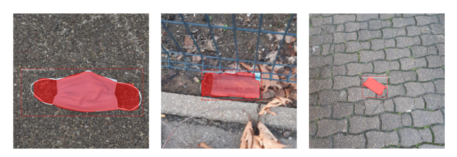
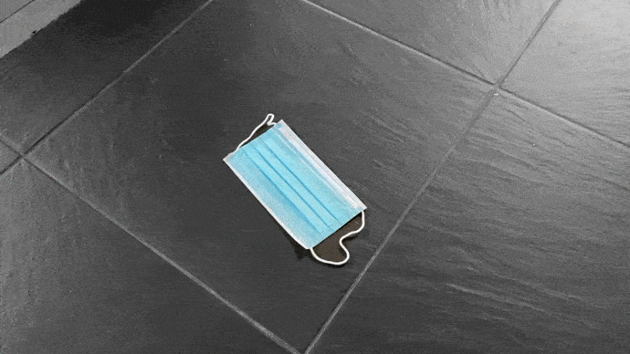

<h1>Disposable Mask Segmentation 😷</h1>

Following the coronavirus crisis, many disposable masks are found in the outdoor environment: in the street, in nature. This crisis brings a new type of waste to the environment. In order to complete the research in waste detection in the natural environment, I have decided to build a detection system capable of identifying and segmenting these masks. 

  

This type of detector could be of interest for building automated systems for collecting waste in the streets for example. 

## 1 - Data

- **Collection**

For this purpose, 65 images of masks found outdoors were used. For the moment, this dataset is small because I started the project at the beginning of 2021. Nevertheless, my relatives and I are collecting new ones every day in order to complete this dataset. 

My goal is to collect 1000 images. 

If you wish to contribute to this project and strengthen the detection system, please feel free to capture images on your side and send them to me by email: cochenercamille@yahoo.fr !

- **Annotation**

The data are annotated and reviewed with <a href="https://labelbox.com/">LabelBox</a> but many other platforms exist. A JSON file is exported and put into the `data/` folder of the repository. 
  
## 2 - Approach 

- ### Instance segmentation with Mask-RCNN
  
To perform instance segmentation on this dataset, I've decided to use the <a href="https://arxiv.org/abs/1703.06870">Mask-RCNN architecture</a> by Kaiming He et al. from Facebook AI Research (FAIR) in 2017. Mask-RCNN is moslty based on Faster-RCNN, which is a two stage detector composed of a region-proposal network, followed by two branches predicting the class and the box offset for each proposed region. The authors extended Faster-RCNN with a *third parallel branch*, outputting a binary mask for the element in each region. Mask-RCNN distinguished itself at the COCO 2017 challenges and is widely used nowadays.  

I've used the <a href="https://github.com/matterport/Mask_RCNN">Matterport implementation of Mask-RCNN</a> to build my detector, which use Python 3, Keras 2.1.5 and TensorFlow 1.14, and adapted it to my needs. 

### Steps

- **Mask-RCNN implementation**  

In my repository, I cloned and named the <a href="https://github.com/matterport/Mask_RCNN">Matterport repository</a> as **maskrcnn/**. I adapted the **dataset.py** file for it to handle annotations file from LabelBox. 

- **Environment**

In my repository, I created a virtual environment with the following command :  
`virtualenv -p /Users/camillecochener/.pyenv/versions/3.7.0/bin/python3 venv`

Don't forget to activate it using :  
`source venv/bin/activate`

Then, I installed the required libraries :  
`pip install -r requirements.txt`

- **Dataset**  

Images can be downloaded from LabelBox thanks to the **download.py** script I wrote :  
`python download.py data/annotations.json`   

Then, the dataset can be split intro three folder train/val/test the script **split_train_val_test.py** :  
`python split_train_val_test.py data`

- **Inspect Data**

To check if the dataset is well loaded, one can run the **inspect_data.ipynb** notebook. It's the originally notebook from the Matterport repository. 

- **Training**

I definitly recommend to train the model with a GPU. I transfered my repository to Google Colab in order to get a GPU and 12Go of RAM. All the previous steps are sum up in the **run_training_colab.ipynb** which allows to train the model.  
Models are stored in a **logs** directory at the root, at each epoch. 

- **Test**

To test the model, I simply used the **inspect_model.ipynb** notebook.  

- **Demo**  

**Note** : The color splash effect aims to have the detected object on a black and white background. 

  

**Next steps**

- Retrain the model with more images
- Compute performance metrics
- Generate a detection video with the mask 
- Adapt the demo.ipynb notebook to my use case
